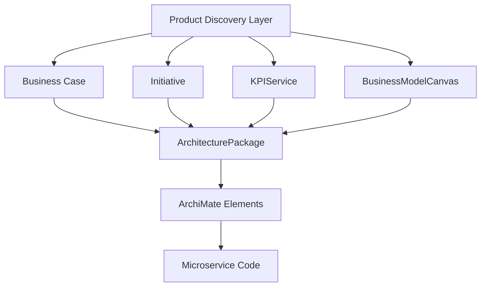

# Architecture Guide: architecture_suite Microservice

## Traceability-First Model

Every `ArchitecturePackage` is linked to Product Discovery Layer items via FKs:
- `business_case_id` → BusinessCase
- `initiative_id` → Initiative
- `kpi_id` → KPIService
- `business_model_id` → BusinessModelCanvas

This enforces traceability from business goals to implementation, supporting audits and impact analysis.

## ArchiMate 3.2 Layer Mapping

- **Strategy Layer:** BusinessCase, Initiative
- **Business Layer:** BusinessModelCanvas
- **Application Layer:** Linked ApplicationComponent, BusinessProcess, etc.
- **Technology Layer:** Linked Technology elements
- **Implementation Layer:** ArchitecturePackage, event emission, code artifacts

## Event-Driven Design & Correlation
- All state changes emit events to Redis with correlation_id for distributed tracing.
- Correlation IDs are propagated via HTTP headers and logs.
- Events include: `architecture_package_created`, `updated`, `deleted`.

## Diagram: Traceability Flow

## ArchiMate Element Linking
- Many-to-many table links `ArchitecturePackage` to any ArchiMate element.
- Each link references a traceability FK, ensuring all elements map to business context.

## Observability
- Structured JSON logging, Prometheus metrics, OpenTelemetry tracing.
- Correlation IDs in all logs, events, and traces.
